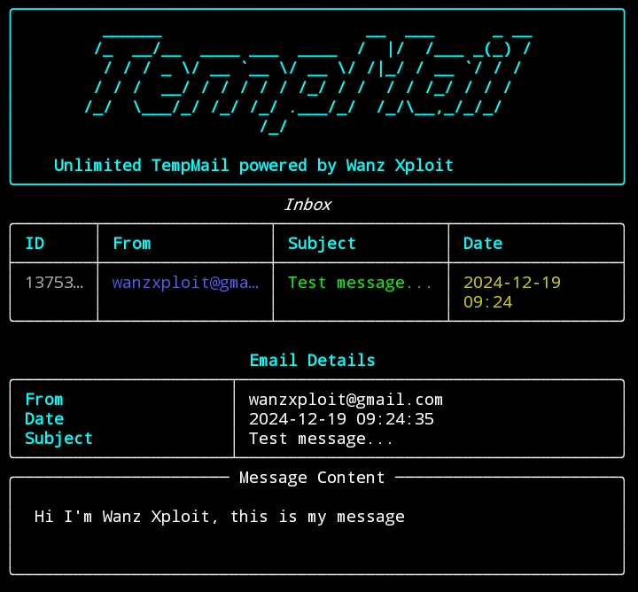

# TempMailViewer



TempMailViewer is a command-line application that allows you to easily create and check temporary emails. This application uses the 1secmail API to generate temporary email addresses and automatically check the inbox.

## Project Structure
```
TempMail/
├── main.py
├── install.sh
├── Makefile
└── banner.png
```

## Features
- Automatic temporary email generation
- Real-time inbox monitoring
- Table view for email list
- Supports HTML and text email formats
- Interactive terminal interface
- Structured and clean email display

## Requirements
- Python 3.7 or higher
- pip package manager
- git

## Installation & Usage

1. Clone repository and enter directory:
```bash
git clone https://github.com/wanzxploit/TempMail.git
cd TempMail
```

2. Install dependencies:
```bash
make install
```

3. Run application:
```bash
make run
```

## Dependencies
- requests
- pyfiglet
- rich

## Troubleshooting

1. Installation Issues
   - Make sure Python and pip are installed on your system
   - Check permissions to run install.sh
   - If using Termux, ensure python package is installed

2. Runtime Issues
   - Ensure port 8000 is not used by other applications
   - Check internet connection for API access
   - Ensure terminal supports Rich formatting

## Contributing

If you want to contribute to this project:
1. Fork repository
2. Create new branch
3. Commit your changes
4. Push to branch
5. Create Pull Request

## License

This project is licensed under the MIT License.

## Author

[Wanz Xploit]
- GitHub: [@wanzxploit](https://github.com/wanzxploit)